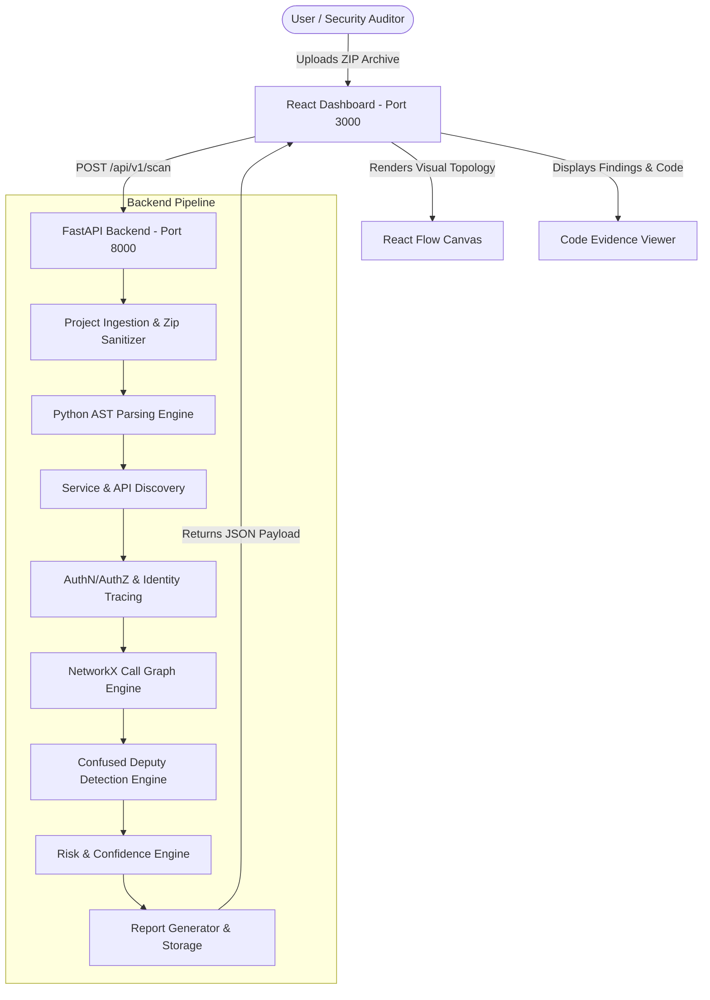
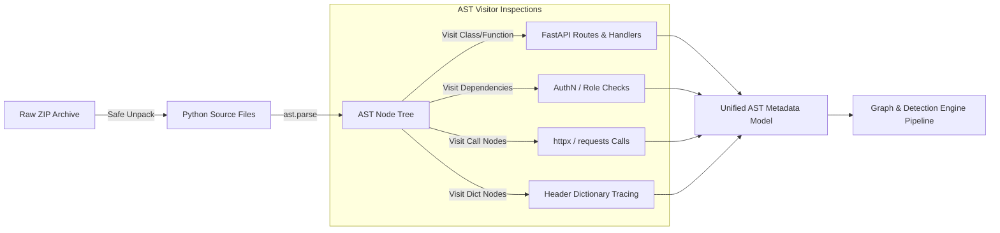
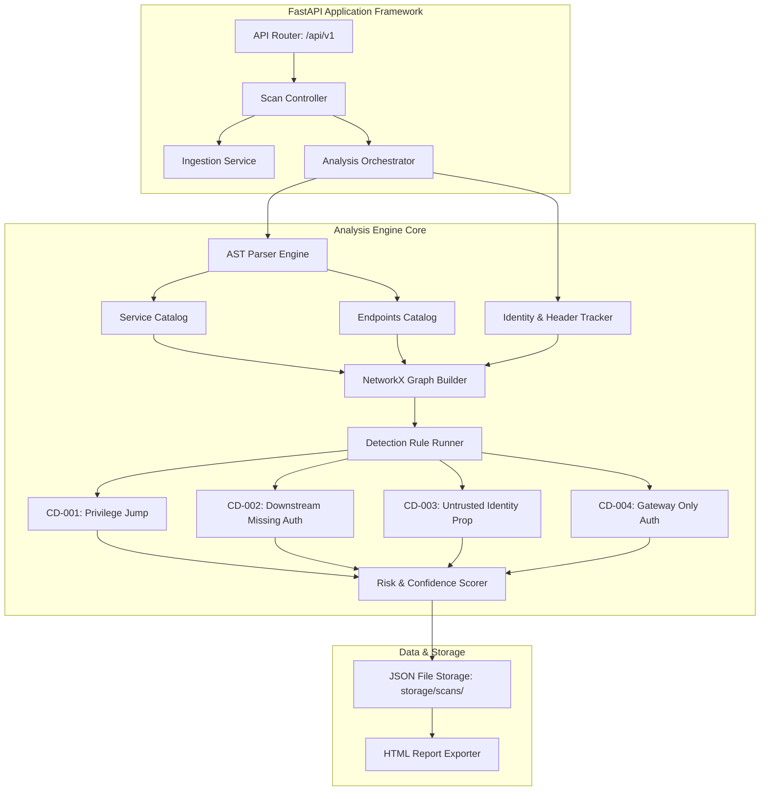
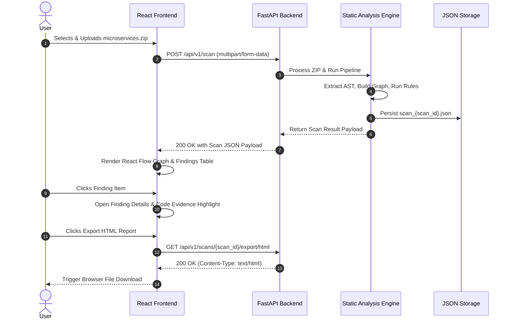
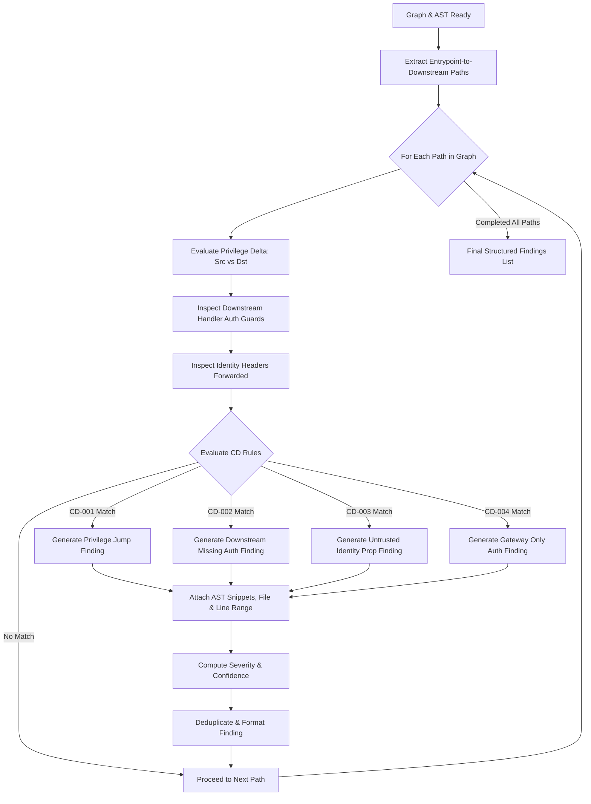
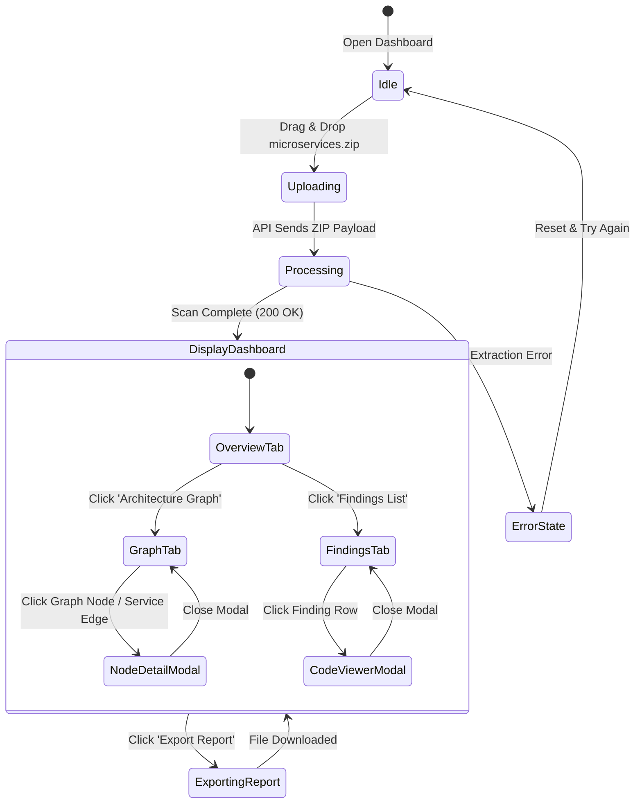

# System Architecture Document
## Confused Deputy API Detector for Microservices

---

## 1. System Overview & Core Pipeline Architecture

The **Confused Deputy API Detector** processes microservices codebases in a single, multi-stage static analysis pipeline. The system ingests packaged microservice repositories, extracts structural syntax ASTs without executing application code, maps cross-service HTTP client calls and identity headers, builds a NetworkX directed graph model, evaluates security detection rules, and presents findings visually via a React dashboard.

```
[ Upload ZIP Archive ]
          │
          ▼
[ 1. Project Ingestion ] ────► Safe Archive Extraction & Validation
          │
          ▼
[ 2. Source Analyzer ] ─────► Python AST Parser (FastAPI routes, AST visitor)
          │
          ▼
[ 3. Service Discovery ] ───► Identify Microservices & Boundaries
          │
          ▼
[ 4. API Discovery ] ───────► Map Endpoints, HTTP Methods & Handlers
          │
          ▼
[ 5. Authorization ] ──────► AuthN/AuthZ Dependencies & Identity Headers
          │
          ▼
[ 6. Call Graph Engine ] ───► NetworkX Directed Call Graph Synthesis
          │
          ▼
[ 7. Detection Engine ] ────► Execute CD-001 to CD-004 Rule Checks
          │
          ▼
[ 8. Risk & Finding Engine]► Severity/Confidence Calculation & Evidence Framing
          │
          ▼
[ 9. FastAPI REST Layer ] ──► JSON Endpoints & HTML/JSON Exporters
          │
          ▼
[ 10. React Dashboard ] ───► React Flow Graph Visualizer & Code Evidence Viewer
```

---

## 2. Component Breakdown & Responsibilities

### 2.1 Project Ingestion Module (`app/ingestion/`)
- **Responsibilities:**
  - Ingest ZIP file payload from FastAPI REST endpoint.
  - Validate file headers, enforce size limits (max 50MB archive, max 100MB extracted), and verify file counts (max 500 files).
  - Strip dangerous path traversal characters (`../`, absolute path roots).
  - Unpack files safely into a temporary workspace directory under `storage/scans/{scan_id}/extracted`.
  - Scan directory tree to locate Python files (`.py`) and metadata configuration files (`pyproject.toml`, `Dockerfile`, `requirements.txt`).

### 2.2 Source Analyzer Module (`app/analyzer/ast_visitor.py`)
- **Responsibilities:**
  - Parse Python source code files into Abstract Syntax Trees using standard library `ast.parse()`.
  - Implement custom `ast.NodeVisitor` classes to inspect:
    - FastAPI app definitions (`app = FastAPI()`, `router = APIRouter()`).
    - Route decorators (`@app.get()`, `@app.post()`, `@router.delete()`).
    - Dependency injection parameters (`Depends(...)`, `Security(...)`).
    - HTTP client calls (`httpx.Client`, `httpx.AsyncClient`, `requests.get/post`, `aiohttp.ClientSession`).
    - String literals representing URL endpoints and custom header key-value pairs (`X-User-Id`, `Authorization`, `X-Service-Token`).

### 2.3 Service Discovery Module (`app/analyzer/service_discovery.py`)
- **Responsibilities:**
  - Group Python source files into logical microservice units based on directory trees, distinct `FastAPI()` instantiations, or service configuration files.
  - Assign unique `service_id` and name attributes (e.g., `order-service`, `payment-service`).
  - Catalog root entrypoint files and declared environment port configurations.

### 2.4 API Discovery Module (`app/analyzer/api_discovery.py`)
- **Responsibilities:**
  - Construct endpoint definitions for each discovered service route.
  - Extract target path template (e.g., `/api/v1/orders/{order_id}`), HTTP method (`GET`, `POST`, `DELETE`), function handler name, file location, and line number ranges.
  - Flag sensitive operations (e.g., operations containing `DELETE`, `refund`, `admin`, `password`, `role`).

### 2.5 Authorization & Privilege Analyzer (`app/analyzer/auth_analyzer.py`)
- **Responsibilities:**
  - Analyze security dependencies (`OAuth2PasswordBearer`, `HTTPBearer`, custom auth functions) attached to FastAPI routes.
  - Detect role checks (`verify_admin`, `require_role("admin")`), ownership checks (`verify_order_owner`), or unauthenticated public routes.
  - Inspect outgoing HTTP client call header dictionary arguments to evaluate identity propagation:
    - *Forwarding User Identity:* Passes incoming request user JWT / user ID downstream.
    - *Service Token Substitution:* Uses hardcoded service key or service-account token without forwarding user context.
    - *Stripped Context:* Drops all authentication headers.

### 2.6 Call Graph Engine (`app/graph/call_graph.py`)
- **Responsibilities:**
  - Instantiate NetworkX `nx.DiGraph` representing the cross-service system topology.
  - Add Node objects for Services and Endpoints annotated with privilege levels, auth guards, and route paths.
  - Add Directed Edge objects for service-to-service HTTP client calls annotated with call type, header types, identity propagation flags, and source code line references.
  - Provide graph querying utilities (e.g., downstream reachability from public entrypoints, path tracing).

### 2.7 Detection Engine (`app/rules/detection_engine.py`)
- **Responsibilities:**
  - Evaluate deterministic rules (CD-001 through CD-004) against the NetworkX call graph and AST metadata model.
  - Trace request paths starting from user-accessible entrypoints down to privileged internal services.
  - Match graph edge patterns against rule definitions.

### 2.8 Risk & Finding Engine (`app/engine/risk_engine.py`)
- **Responsibilities:**
  - Compute Severity (LOW, MEDIUM, HIGH, CRITICAL) based on privilege delta, operation sensitivity, and downstream auth gaps.
  - Compute Confidence (LOW, MEDIUM, HIGH) based on evidence certainty (e.g., explicit AST string literal vs dynamic string template).
  - Construct structured `Finding` objects containing source code evidence, AST line references, limitations, and remediation guidance.

### 2.9 API & Reporting Layer (`app/api/` & `app/reporting/`)
- **Responsibilities:**
  - Expose FastAPI endpoints (`POST /api/v1/scan`, `GET /api/v1/scans/{scan_id}`, `GET /api/v1/scans/{scan_id}/export/html`).
  - Render self-contained HTML audit reports using Jinja2 templates.

### 2.10 Frontend React Dashboard (`frontend/src/`)
- **Responsibilities:**
  - Interactive upload interface with drag-and-drop support.
  - React Flow graph visualizer showing service nodes, API routes, and risk-annotated edges.
  - Finding detail viewer with side-by-side source code evidence and remediation guides.

---

## 3. Architecture Diagrams (Mermaid)

### Diagram 1: High-Level System Architecture


### Diagram 2: Static Analysis Pipeline


### Diagram 3: Service-Call Graph Representation
```mermaid
flowchart LR
    subgraph Public Entry Boundary
        U([User Client]) -->|POST /orders/refund| GW[API Gateway / Router]
    end

    subgraph Service Layer: Order Service (USER Privilege)
        GW -->|User JWT Auth| OrderSvc[Order Service Handler]
        OrderSvc -->|Validates User JWT| OrderAuth[Auth Check: Valid]
    end

    subgraph Service Layer: Payment Service (ELEVATED Privilege)
        OrderSvc -->|HTTP POST /api/v1/payment/refund| PaySvc[Payment Service Handler]
        PaySvc -->|X-Service-Token Auth| PayAuth[Auth Check: Service Only]
        PayAuth -.->|MISSING USER AUTHZ CHECK| VulnerableOp[(Financial Refund Database)]
    end

    style VulnerableOp fill:#f9f,stroke:#333,stroke-width:2px,fill:#ff4d4d,color:#fff
    style PayAuth fill:#ffffb3,stroke:#333,stroke-width:1px
```

### Diagram 4: Backend Component Architecture


### Diagram 5: Frontend/Backend Communication Sequence


### Diagram 6: Finding-Generation Flow


### Diagram 7: User Interaction Flow

