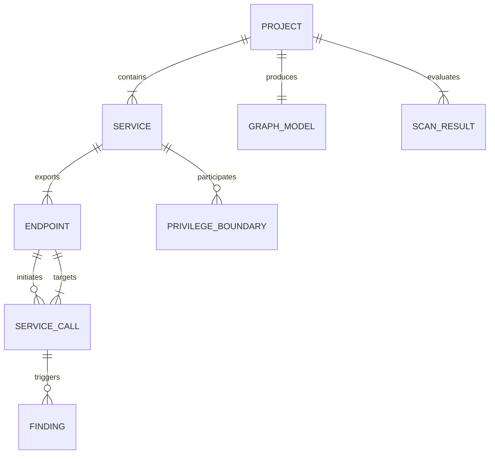

# Data Model and Schema Specification
## Confused Deputy API Detector for Microservices

---

## 1. Schema Definitions & Models

All data models are specified as typed Pydantic v2 schemas used in the backend pipeline and serialized to JSON.

### 1.1 Project Schema (`Project`)
Represents the root uploaded application metadata.

```python
class Project(BaseModel):
    project_id: str          # UUID string
    project_name: str        # Extracted or ZIP filename
    uploaded_at: str         # ISO 8601 timestamp
    language: str = "python" # Primary language
    framework: str = "fastapi" # Framework detected
    total_files: int
    scan_status: str         # PENDING, PROCESSING, COMPLETED, FAILED
    analysis_version: str    # Engine version e.g. "1.0.0"
```

### 1.2 Service Schema (`Service`)
Represents a discovered microservice boundary.

```python
class Service(BaseModel):
    service_id: str          # Unique string ID e.g. "svc_order"
    name: str                # Service directory/app name
    path: str                # Relative filesystem root path
    language: str = "python"
    framework: str = "fastapi"
    privilege_level: str     # PUBLIC, USER, SERVICE, ADMIN, UNKNOWN
    confidence: str          # LOW, MEDIUM, HIGH
    entry_points: List[str]  # List of main python file paths
```

### 1.3 Endpoint Schema (`Endpoint`)
Represents an HTTP API route handler defined within a service.

```python
class Endpoint(BaseModel):
    endpoint_id: str         # Unique string ID e.g. "ep_order_cancel"
    service_id: str          # Parent service ID
    method: str              # GET, POST, PUT, DELETE, PATCH
    route: str               # URL path template e.g. "/api/v1/orders/{id}/cancel"
    handler: str             # Python function name e.g. "cancel_order"
    file: str                # Source file path relative to repo root
    line_start: int          # Function start line
    line_end: int            # Function end line
    authentication: bool     # True if auth scheme/middleware detected
    authorization_checks: List[str] # List of detected guards e.g. ["verify_user_owner"]
    is_sensitive: bool       # Flagged for sensitive state-change operation
```

### 1.4 ServiceCall Schema (`ServiceCall`)
Represents an outgoing HTTP client call initiated from an endpoint handler.

```python
class ServiceCall(BaseModel):
    call_id: str                 # Unique string ID e.g. "call_101"
    source_service_id: str       # Caller service ID
    source_endpoint_id: str      # Caller endpoint ID
    destination_service_id: str  # Inferred target service ID
    destination_route: str       # Target URL path or pattern
    http_method: str             # Target HTTP method
    source_file: str             # File where client call occurs
    source_line: int             # Line number of client call
    call_type: str               # "HTTP_CLIENT" (httpx/requests)
    identity_propagation: str    # FORWARDED_USER_JWT, SERVICE_TOKEN, STRIPPED, UNKNOWN
    passed_headers: List[str]    # List of header names passed e.g. ["X-User-Id", "Authorization"]
```

### 1.5 PrivilegeBoundary Schema (`PrivilegeBoundary`)
Represents a transition between differing privilege contexts across a service call edge.

```python
class PrivilegeBoundary(BaseModel):
    boundary_id: str
    source_service_id: str
    destination_service_id: str
    source_privilege: str        # e.g. "USER"
    destination_privilege: str   # e.g. "ELEVATED"
    evidence: str                # AST explanation of privilege difference
    confidence: str              # LOW, MEDIUM, HIGH
```

### 1.6 Finding Schema (`Finding`)
Represents a confirmed security rule finding.

```python
class Finding(BaseModel):
    finding_id: str                        # Unique string ID e.g. "FINDING-CD001-01"
    rule_id: str                           # "CD-001", "CD-002", "CD-003", "CD-004"
    title: str                             # Concise human readable title
    severity: str                          # LOW, MEDIUM, HIGH, CRITICAL
    confidence: str                        # LOW, MEDIUM, HIGH
    source_service_id: str                 # Entry service
    destination_service_id: str            # Vulnerable target service
    endpoint_id: str                       # Affected endpoint
    request_path: List[str]                # List of endpoint/service IDs tracing path
    evidence_snippet: str                  # Source code snippet
    source_file: str                       # File location of flaw
    line_number: int                       # Primary line number
    authorization_observations: List[str]  # Observed auth controls or gaps
    privilege_observations: List[str]      # Observed privilege levels
    limitations: str                       # Static analysis uncertainties
    remediation: str                       # Step-by-step fix guidance
```

### 1.7 Graph Schema (`GraphModel`)
Represents the serialized NetworkX graph payload for React Flow rendering.

```python
class GraphNode(BaseModel):
    id: str                  # Endpoint or Service ID
    label: str               # Display name
    type: str                # "SERVICE_NODE" or "ENDPOINT_NODE"
    data: Dict[str, Any]     # Metadata (privilege, auth status)

class GraphEdge(BaseModel):
    id: str                  # Edge ID
    source: str              # Source node ID
    target: str              # Target node ID
    label: str               # HTTP method & path
    data: Dict[str, Any]     # Call type, identity prop status, risk flag

class GraphModel(BaseModel):
    nodes: List[GraphNode]
    edges: List[GraphEdge]
```

### 1.8 Scan Result Schema (`ScanResult`)
Complete serialized scan result JSON.

```python
class ScanResult(BaseModel):
    scan_id: str
    project: Project
    services: List[Service]
    endpoints: List[Endpoint]
    service_calls: List[ServiceCall]
    privilege_boundaries: List[PrivilegeBoundary]
    graph: GraphModel
    findings: List[Finding]
    summary_stats: Dict[str, int] # e.g. {"critical": 1, "high": 2, "medium": 0, "low": 0}
```

---

## 2. Realistic JSON Examples (Synthetic Benchmark Data)

### 2.1 Complete Scan Result Example (`scan_result.json`)

```json
{
  "scan_id": "scan_8f1a3b2c-9012-4e56-b789-0123456789ab",
  "project": {
    "project_id": "proj_demo_vulnerable_01",
    "project_name": "ecommerce_microservices.zip",
    "uploaded_at": "2026-10-01T21:30:00Z",
    "language": "python",
    "framework": "fastapi",
    "total_files": 12,
    "scan_status": "COMPLETED",
    "analysis_version": "1.0.0"
  },
  "services": [
    {
      "service_id": "svc_order",
      "name": "order-service",
      "path": "services/order_service",
      "language": "python",
      "framework": "fastapi",
      "privilege_level": "USER",
      "confidence": "HIGH",
      "entry_points": ["services/order_service/main.py"]
    },
    {
      "service_id": "svc_payment",
      "name": "payment-service",
      "path": "services/payment_service",
      "language": "python",
      "framework": "fastapi",
      "privilege_level": "ELEVATED",
      "confidence": "HIGH",
      "entry_points": ["services/payment_service/main.py"]
    }
  ],
  "endpoints": [
    {
      "endpoint_id": "ep_order_cancel",
      "service_id": "svc_order",
      "method": "POST",
      "route": "/api/v1/orders/{order_id}/cancel",
      "handler": "cancel_order",
      "file": "services/order_service/main.py",
      "line_start": 42,
      "line_end": 58,
      "authentication": true,
      "authorization_checks": ["verify_user_jwt"],
      "is_sensitive": true
    },
    {
      "endpoint_id": "ep_payment_refund",
      "service_id": "svc_payment",
      "method": "POST",
      "route": "/internal/v1/refund",
      "handler": "process_refund",
      "file": "services/payment_service/main.py",
      "line_start": 25,
      "line_end": 45,
      "authentication": true,
      "authorization_checks": ["verify_service_key"],
      "is_sensitive": true
    }
  ],
  "service_calls": [
    {
      "call_id": "call_order_to_payment_01",
      "source_service_id": "svc_order",
      "source_endpoint_id": "ep_order_cancel",
      "destination_service_id": "svc_payment",
      "destination_route": "/internal/v1/refund",
      "http_method": "POST",
      "source_file": "services/order_service/main.py",
      "source_line": 52,
      "call_type": "HTTP_CLIENT",
      "identity_propagation": "SERVICE_TOKEN",
      "passed_headers": ["X-Service-Key", "X-User-Id"]
    }
  ],
  "privilege_boundaries": [
    {
      "boundary_id": "pb_order_payment",
      "source_service_id": "svc_order",
      "destination_service_id": "svc_payment",
      "source_privilege": "USER",
      "destination_privilege": "ELEVATED",
      "evidence": "Payment Service accesses direct database refund tables with elevated service token.",
      "confidence": "HIGH"
    }
  ],
  "graph": {
    "nodes": [
      {
        "id": "svc_order",
        "label": "Order Service",
        "type": "SERVICE_NODE",
        "data": { "privilege": "USER", "auth": "User JWT" }
      },
      {
        "id": "svc_payment",
        "label": "Payment Service",
        "type": "SERVICE_NODE",
        "data": { "privilege": "ELEVATED", "auth": "Service Token Only" }
      }
    ],
    "edges": [
      {
        "id": "edge_order_pay",
        "source": "svc_order",
        "target": "svc_payment",
        "label": "POST /internal/v1/refund",
        "data": { "risk": true, "rule": "CD-001" }
      }
    ]
  },
  "findings": [
    {
      "finding_id": "FINDING-CD001-01",
      "rule_id": "CD-001",
      "title": "Potential Privilege-Boundary Confused Deputy Vulnerability",
      "severity": "HIGH",
      "confidence": "HIGH",
      "source_service_id": "svc_order",
      "destination_service_id": "svc_payment",
      "endpoint_id": "ep_payment_refund",
      "request_path": ["ep_order_cancel", "call_order_to_payment_01", "ep_payment_refund"],
      "evidence_snippet": "response = httpx.post('http://payment-service/internal/v1/refund', headers={'X-Service-Key': 'SECRET', 'X-User-Id': user_id})",
      "source_file": "services/order_service/main.py",
      "line_number": 52,
      "authorization_observations": [
        "Upstream Order Service enforces User JWT validation.",
        "Downstream Payment Service validates X-Service-Key but lacks user resource ownership check."
      ],
      "privilege_observations": [
        "Order Service operates at USER privilege boundary.",
        "Payment Service executes at ELEVATED privilege boundary (financial refund capability)."
      ],
      "limitations": "Static AST confirms hardcoded X-Service-Key passing; dynamic runtime token scope was not evaluated.",
      "remediation": "Enforce end-to-end user identity delegation or require Payment Service to perform ownership validation on X-User-Id."
    }
  ],
  "summary_stats": {
    "critical": 0,
    "high": 1,
    "medium": 0,
    "low": 0,
    "total": 1
  }
}
```

---

## 3. Data Relationship ER Diagram (Mermaid)


